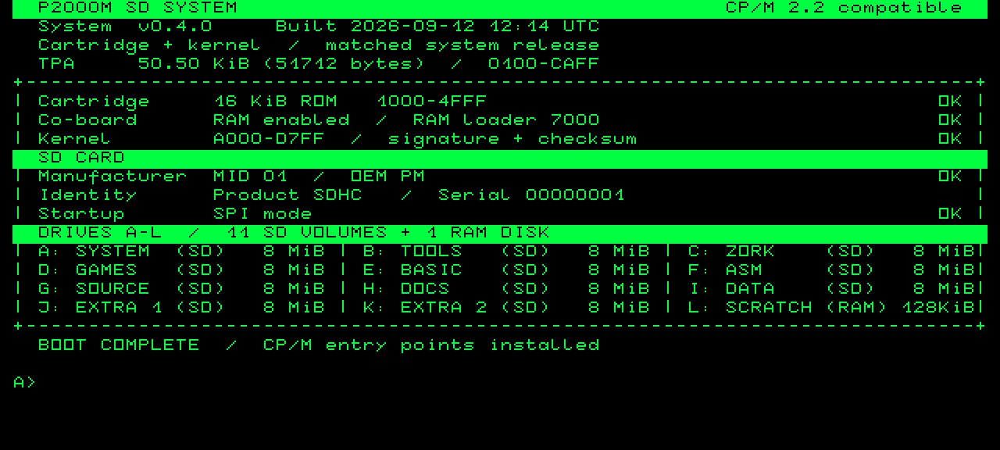
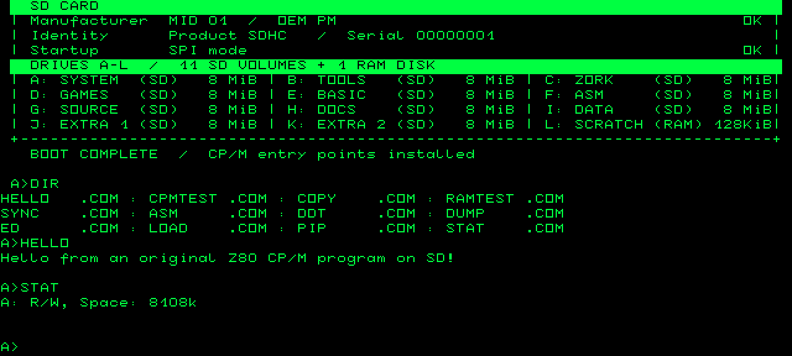

# Philips P2000M SD CP/M

[](https://github.com/ifilot/p2000m-cpm/actions/workflows/build.yml)
[](https://github.com/ifilot/p2000m-cpm/tags)
[](LICENSE)

P2000M SD CP/M is an independent, CP/M 2.2-compatible system for the Philips
P2000M. It uses the CP/M co-board, a 16 KiB boot cartridge in port 1, and an
SD/SRAM cartridge in port 2; no floppy hardware is required.

The supplied SD image includes the command processor, PIP, ASM, LOAD, DDT,
DUMP, ED, STAT, Microsoft BASIC-80, Microsoft COBOL-80, BDS C, SuperCalc2, Zork I–III, diagnostics, and twelve
drives. Drive L: is a temporary 128 KiB SRAM disk; the other drives live on SD.

## Screenshots

Boot dashboard, captured from the emulator:



Running DIR, HELLO, and STAT:



## Download

Download the matching files from the
[latest release](https://github.com/ifilot/p2000m-cpm/releases/latest):

- [`cartridge.bin`](https://github.com/ifilot/p2000m-cpm/releases/latest/download/cartridge.bin) — 16 KiB port-1 ROM image
- [`p2000m-sd-template.img.gz`](https://github.com/ifilot/p2000m-cpm/releases/latest/download/p2000m-sd-template.img.gz) — compressed bootable SD-card image
- [`SHA256SUMS`](https://github.com/ifilot/p2000m-cpm/releases/latest/download/SHA256SUMS) — download checksums

Builds for every commit are available from
[GitHub Actions](https://github.com/ifilot/p2000m-cpm/actions/workflows/build.yml).
They are development snapshots; tagged releases are the recommended downloads.

## Install

Back up an existing card first. The cartridge and SD image are a matched pair
and must be updated together.

1. Program `cartridge.bin` into the 16 KiB port-1 cartridge.
2. Decompress `p2000m-sd-template.img.gz`.
3. Write the complete raw `.img` to an SDHC card of at least 4 GB. Do not copy
   the image file into the card's filesystem.
4. Install the CP/M co-board, insert the ROM cartridge in port 1 and the SD/SRAM
   cartridge in port 2, then reset the machine.

In the emulator, use the same ROM and a writable copy of the decompressed SD
image, with the CP/M co-board and SD cartridge enabled.

## First use

```text
A>DIR
A>HELLO
A>CPMTEST
A>B:
B>CC CDEMO
B>CLINK CDEMO
B>CDEMO
A>D:
D>SC2
A>E:
E>MBASIC BASDEMO
A>F:
F>COBOL =SQUARO
A>HELP
A>C:
C>ZORK1
```

Wait for the command prompt before resetting or switching off: SD writes are
buffered. From another drive, `A:SYNC` explicitly flushes pending writes. Drive
L: is erased by a reset or power cycle.

See the [user guide](docs/user-guide.md) for upgrades, drive contents, keyboard
controls, included software, and data-safety notes.

## License

Original project code is released under [GNU GPLv3](LICENSE). Bundled third-party
code and historical binaries retain their own license and provenance notices.
