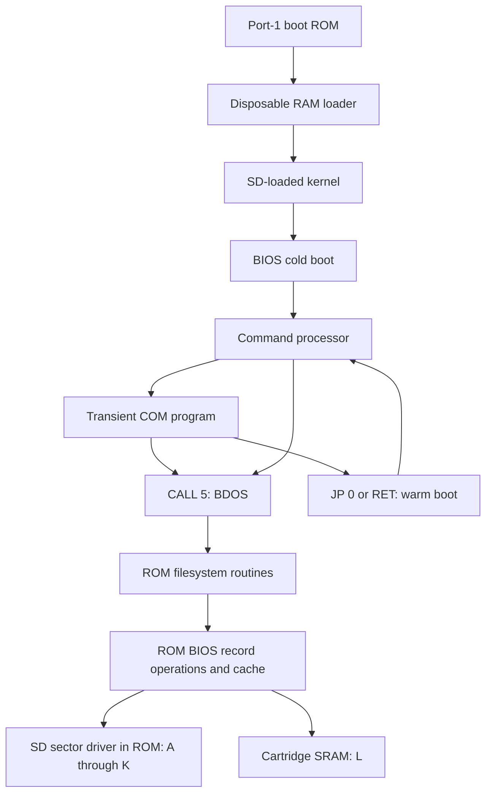

# Reading the Z80 system

Start with `src/kernel.asm` to see how the resident image is assembled, then
follow `src/cartridge.asm` from reset to the kernel entry. The cartridge
switches the installed co-board into its CP/M memory map, initializes SDHC,
checks the system header and checksum, and loads the kernel from SD. The BIOS
cold boot initializes the operating-system workspace, validates the disk
layout and formats the cartridge SRAM. Warm boot rebuilds the page-zero entry
points and returns to the command prompt without formatting SRAM.



## Reading order and routine groups

| Source | What to follow |
| --- | --- |
| `src/cartridge.asm` | Boot relocation/map switch, SD initialization, command packets, sector read/write, byte transfers |
| `src/kernel.asm` | Fixed origins and include order; the kernel entry |
| `src/bios.asm` | Fixed 17-entry BIOS jump table, safe cold restart, warm lifecycle and writable disk/console state |
| `src/boot_loader.asm` | Disposable RAM loader: header/checksum validation, retries, CID and boot messages |
| `src/cold_boot.asm` | Disposable kernel initialization, SRAM formatting and dashboard strings |
| `src/disk_io.asm` | ROM disk latches, SD deblocking and SRAM access |
| `src/rom_tables.asm` | Read-only BDOS dispatch and disk parameter blocks |
| `src/cache.asm` | Separate 512-byte data/directory caches, ordered flush, failed-write retention and fill invalidation |
| `src/console.asm` | Register-preserving output, printable characters, scrolling and keyboard tables |
| `src/terminal.asm` | Resident VT52-style escape parser, cursor movement, erasure and rendition |
| `src/keyboard.asm`, `src/keyboard_repeat.asm` | CTC/IM2 handler, per-key debounce, FIFO, polling fallback and repeat |
| `src/keyboard.inc` | Keyboard state in previously unused workspace |
| `src/ccp.asm` | Prompt loop, token/FCB parsing, built-ins, COM loading and application entry |
| `src/bdos.asm` | Public register-saving wrapper, numbered dispatch table, console and drive services, workspace |
| `src/filesystem.asm` | Drive selection, directory cache/scanning, allocation, FCB matching, sequential/random transfers, file size |
| `src/fcb.asm` | Resident FCB positioning/synchronization and allocation-pointer validation |
| `programs/serpins/`, `programs/sertx/`, `programs/serrx/`, `programs/common/serial_test.inc` | Standalone built-in RS232 diagnostics and shared software-timed serial routines |
| `programs/hello/` | Smallest application: print through BDOS and return |
| `programs/copy/` | Two independent FCBs, DMA, read/write/close, refusal to overwrite |
| `programs/sync/` | Explicit cache commit through BDOS disk reset |
| `programs/cpmtest/`, `programs/ramtest/`, `programs/common/filetest.inc` | Shared progress, cancellation, sequential and random-read verification; A:-only SD regression or L:-only RAM file test |

Section separators group related operations without moving machine code.
Some routines deliberately fall through into the next routine, while others
use `JP` to a shared exit. Moving either can change behavior. Labels inside a
routine usually name branches; they do not imply a new callable interface.
Fixed BIOS vectors and BDOS table positions are part of the application ABI.

## Register contracts

Each routine header describes its inputs, outputs and possible clobbers.
`AF` includes the flags; `CY` means the carry flag, whereas `C` means register C.
A clobber is permission to change a register, not a promise that every path
changes it. Unlisted registers are preserved on returning paths. A routine
that transfers to warm boot has no returning-path preservation guarantee.
Memory side effects and implicit workspace inputs appear alongside the
register contract. Multi-byte values in memory are little-endian.

Applications call address `0005h` with C as the BDOS function number and DE as
the argument. The public wrapper switches stacks, saves C/DE/IX/IY and dispatches
to a private handler. It returns HL, with A mirroring L and B mirroring H.
Private handlers have broader clobbers and often consume `argument` or an
IX-indexed FCB. Do not infer their contract from the public wrapper.

The stack is balanced across returning calls. The alternate Z80 register set
is unused. BDOS workspace is shared and its entry is not reentrant. The
address map and individual BIOS entries are listed in [design.md](design.md).

## Disk units and filesystem state

A CP/M **record** is 128 bytes; an SD **sector** is 512 bytes. The BIOS selects
one of four record positions within a sector and uses read/modify/write for
a record write. A logical track is only arithmetic for record addressing;
it does not refer to a floppy mechanism.

A: and B: each have 2,048 allocation blocks of 4 KiB. Their first four blocks
hold 512 directory entries. Each directory entry describes up to 32 KiB using
eight 16-bit block numbers. CP/M still counts logical extents in 16 KiB units,
so the SD disk parameter block has EXM=1. L: uses 1 KiB blocks and byte-sized
allocation entries; its first two blocks hold its 64 directory entries.

An FCB is the application's mutable file state. Directory scanning uses a
separate cached record, an entry pointer within it, and a saved entry copy.
Sequential and random operations ultimately share the same record-transfer
path. The allocation bitmap is rebuilt from directory contents. Refer to the
workspace declarations at the end of `bdos.asm` for field widths and units.

## Verification

Run these from the repository root:

```sh
make -C programs/othello othello
python3 tools/build.py
python3 -m unittest discover -s tests -v
python3 tools/test_emulator.py
python3 tools/test_programs.py
```

Requirements are Python 3.11+, `z80asm` (Debian syntax), GCC/G++ with C++17,
and Docker for the stand-alone Z88DK image used to compile Othello.
The six Zork COM/DAT files are bundled in `assets/zork`; their provenance is
recorded in its [README](../assets/zork/README.md). No companion checkout is
needed for building or testing. `--zork-dir /path/to/zork` optionally overrides
the bundled files.
Both emulator runners compile the bundled [headless core](../tests/emulator/README.md)
and operate on temporary SD images. They also accept
`--emulator /path/to/p2000m-emulator` for upstream comparisons.

GitHub Actions builds these artifacts on every commit and creates releases from
tags. The full behavioral suite uses the bundled core without Qt or a private
repository token. See the
[continuous-integration guide](continuous-integration.md) for the dependency,
pinned revisions, artifacts, and release rules.

The assembly regression fixture records reviewed machine-code hashes. The
0.4.0 ROM/kernel baseline includes the split ROM filesystem and relocated
workspace/TPA, hidden boot attempt counts, fresh-line warm-boot prompts and
ROM-resident SD CRC protection with disposable boot display code.
SOURCE_DATE_EPOCH=0 fixes metadata during the assembly regression.
The two-pass link checks all ROM/RAM cross-references and rejects region overflow.
It checks the ROM, full kernel, original programs and TPA
boundary fixture, including their addresses, padding and fall-through layout.
The physical-keyboard correction adds 19 ROM bytes for ASCII glyph translation;
its deterministic ROM/kernel baseline was reviewed against the original build.
Image sizes and the TPA remain unchanged; kernel byte changes are the paired
link identity and relocated ROM references. Physical-key tests cover the changed
input values, and terminal/SuperCalc tests cover their rendering.
Do not automatically regenerate it on failure: a legitimate instruction
change requires explicit review of the new baseline and behavioral tests.

Image unit tests check partition/FAT structure, extent round trips and invalid
inputs. The system suite checks boot, absent/corrupt media, partition boundaries,
SD persistence, SRAM banks, warm boot, filesystem limits, user areas, attributes,
and the TPA boundary. It also exercises the applications together.
`test_sd_crc.py` and `sd_crc.cpp` exercise the actual Z80 CRC routines and
corrupt SPI traffic through the emulator's public bridge ports. They check
CRC vectors, mandatory CMD59, CID/sector rejection, recovery and cache retention.

`test_keytest.py` boots the built SD template and runs `KEYTEST.COM` through
CCP. It exercises all 80 raw matrix contacts, entire-screen character/attribute
integrity, release/overlap/hold behavior, both Shift keys, Shift Lock, queued NUL
on exit, and return to normal CP/M input. The whole SD image is checked for
unintended writes. See the [KEYTEST guide](../programs/keytest/README.md).

The separate program suite boots a fresh machine/card for each utility:

| Case | Assertion |
| --- | --- |
| HELLO | Expected console output and return to CCP |
| COPY, PIP | Byte-exact binary copy across a 32 KiB extent boundary |
| COPYEXISTS | Existing destination is refused and preserved byte-exact |
| CPMTEST | Its read-back tests cover A: only; RAMTEST covers L:, emulator tests cover all twelve |
| ASM | Generated Intel HEX checksums and expected machine code |
| LOAD | Independently supplied HEX becomes executable expected COM code |
| DDT | Fill changes exactly the requested memory range; G0 returns |
| DUMP | First and last rows match a known 128-byte input |
| ED | Inserted text is saved to the SD filesystem |
| STAT | Disk space report and return to CCP |
| ABI | Register snapshots for BIOS setters, translation, console calls and BDOS version/unknown dispatch |

Persistent application outputs are decoded independently on the host after the
emulator exits. Every case checks that the full FAT32 partition is unchanged.
The ABI tests execute actual Z80 calls with sentinel register values; they
cover selected public contracts, not every private routine or every possible
utility command. These are emulator tests, not physical-hardware validation.

## Commenting reference

The organization takes stylistic inspiration from
[z80pack's CP/M 2 BIOS source](https://github.com/udo-munk/z80pack/blob/master/cpmsim/srccpm2/bios.asm):
its annotated BIOS entry table, grouped hardware constants, console/disk
routines and disk parameter fields make the hardware boundary easy to follow.
No implementation code was copied for this documentation pass. The standard
Digital Research utilities remain unchanged binaries; their provenance is in
[the bundled utilities README](../assets/cpm_core/README.md).
