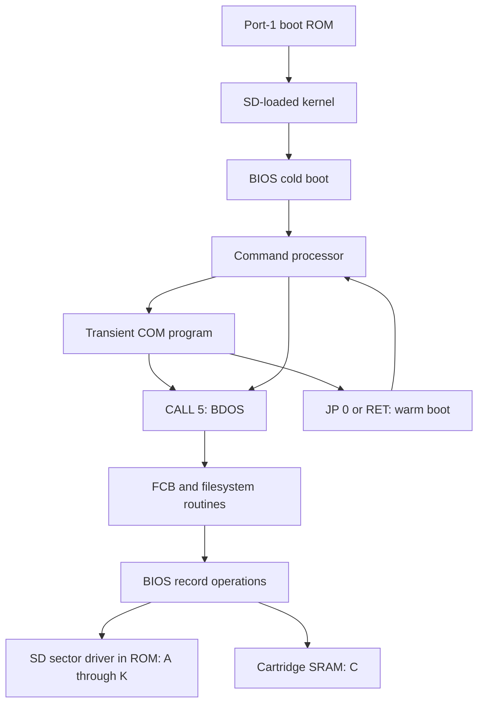

# Reading the Z80 system

Start with `src/kernel.asm` to see how the resident image is assembled, then
follow `src/cartridge.asm` from reset to the kernel entry. The cartridge
switches the installed co-board into its CP/M memory map, initializes SDHC,
checks the system header and checksum, and loads the kernel from SD. The BIOS
cold boot initializes the operating-system workspace, validates the disk
layout and formats the cartridge SRAM. Warm boot rebuilds the page-zero entry
points and returns to the command prompt without formatting SRAM.



## Reading order and routine groups

| Source | What to follow |
| --- | --- |
| `src/cartridge.asm` | Boot relocation/map switch, SD initialization, command packets, sector read/write, byte transfers |
| `src/kernel.asm` | Fixed origins and include order; the kernel entry |
| `src/bios.asm` | Fixed 17-entry BIOS jump table, cold/warm lifecycle, disk latches, SD deblocking, SRAM access, disk parameter tables |
| `src/cache.asm` | Separate 512-byte data/directory caches, ordered flush, failed-write retention and fill invalidation |
| `src/console.asm` | Screen cursor and control characters, keyboard scanning, pending-character state |
| `src/ccp.asm` | Prompt loop, token/FCB parsing, built-ins, COM loading and application entry |
| `src/bdos.asm` | Public register-saving wrapper, numbered dispatch table, console and drive services, workspace |
| `src/filesystem.asm` | Drive selection, directory cache/scanning, allocation, FCB matching, sequential/random transfers, file size |
| `programs/hello.asm` | Smallest application: print through BDOS and return |
| `programs/copy.asm` | Two independent FCBs, DMA, read/write/close, refusal to overwrite |
| `programs/sync.asm` | Explicit cache commit through BDOS disk reset |
| `programs/cpmtest.asm`, `programs/ramtest.asm`, `programs/filetest.inc` | Shared progress, cancellation, sequential and random-read verification; A:-only SD regression or L:-only RAM file test |

Section separators group related operations without moving machine code.
Some routines deliberately fall through into the next routine, while others
use `JP` to a shared exit. Moving either can change behavior. Labels inside a
routine usually name branches; they do not imply a new callable interface.
Fixed BIOS vectors and BDOS table positions are part of the application ABI.

## Register contracts

Each routine header describes its inputs, outputs and possible clobbers.
`AF` includes the flags; `CY` means the carry flag, whereas `C` means register C.
A clobber is permission to change a register, not a promise that every path
changes it. Unlisted registers are preserved on returning paths. A routine
that transfers to warm boot has no returning-path preservation guarantee.
Memory side effects and implicit workspace inputs appear alongside the
register contract. Multi-byte values in memory are little-endian.

Applications call address `0005h` with C as the BDOS function number and DE as
the argument. The public wrapper switches stacks, saves C/DE/IX/IY and dispatches
to a private handler. It returns HL, with A mirroring L and B mirroring H.
Private handlers have broader clobbers and often consume `argument` or an
IX-indexed FCB. Do not infer their contract from the public wrapper.

The stack is balanced across returning calls. The alternate Z80 register set
is unused. BDOS workspace is shared and its entry is not reentrant. The
address map and individual BIOS entries are listed in [design.md](design.md).

## Disk units and filesystem state

A CP/M **record** is 128 bytes; an SD **sector** is 512 bytes. The BIOS selects
one of four record positions within a sector and uses read/modify/write for
a record write. A logical track is only arithmetic for record addressing;
it does not refer to a floppy mechanism.

A: and B: each have 2,048 allocation blocks of 4 KiB. Their first four blocks
hold 512 directory entries. Each directory entry describes up to 32 KiB using
eight 16-bit block numbers. CP/M still counts logical extents in 16 KiB units,
so the SD disk parameter block has EXM=1. L: uses 1 KiB blocks and byte-sized
allocation entries; its first two blocks hold its 64 directory entries.

An FCB is the application's mutable file state. Directory scanning uses a
separate cached record, an entry pointer within it, and a saved entry copy.
Sequential and random operations ultimately share the same record-transfer
path. The allocation bitmap is rebuilt from directory contents. Refer to the
workspace declarations at the end of `bdos.asm` for field widths and units.

## Verification

Run these from the repository root:

```sh
python3 tools/build.py
python3 -m unittest discover -s tests -v
python3 tools/test_emulator.py
python3 tools/test_programs.py
```

Both emulator runners accept `--emulator /path/to/p2000m-emulator`, compile the
actual emulator core and operate on temporary SD images. They do not modify
the emulator checkout or a user's working card.

The assembly regression fixture records reviewed machine-code hashes. The
cartridge, kernel and CPMTEST baselines include the boot diagnostics, progress
reporting and cancellation changes; other artifacts retain their original hashes.
It checks the ROM, full kernel, original programs and TPA
boundary fixture, including their addresses, padding and fall-through layout.
Do not automatically regenerate it on failure: a legitimate instruction
change requires explicit review of the new baseline and behavioral tests.

Image unit tests check partition/FAT structure, extent round trips and invalid
inputs. The system suite checks boot, absent/corrupt media, partition boundaries,
SD persistence, SRAM banks, warm boot, filesystem limits, user areas, attributes,
and the TPA boundary. It also exercises the applications together.

The separate program suite boots a fresh machine/card for each utility:

| Case | Assertion |
| --- | --- |
| HELLO | Expected console output and return to CCP |
| COPY, PIP | Byte-exact binary copy across a 32 KiB extent boundary |
| COPYEXISTS | Existing destination is refused and preserved byte-exact |
| CPMTEST | Its read-back tests cover A: only; RAMTEST covers L:, emulator tests cover all twelve |
| ASM | Generated Intel HEX checksums and expected machine code |
| LOAD | Independently supplied HEX becomes executable expected COM code |
| DDT | Fill changes exactly the requested memory range; G0 returns |
| DUMP | First and last rows match a known 128-byte input |
| ED | Inserted text is saved to the SD filesystem |
| STAT | Disk space report and return to CCP |
| ABI | Register snapshots for BIOS setters, translation, console calls and BDOS version/unknown dispatch |

Persistent application outputs are decoded independently on the host after the
emulator exits. Every case checks that the full FAT32 partition is unchanged.
The ABI tests execute actual Z80 calls with sentinel register values; they
cover selected public contracts, not every private routine or every possible
utility command. These are emulator tests, not physical-hardware validation.

## Commenting reference

The organization takes stylistic inspiration from
[z80pack's CP/M 2 BIOS source](https://github.com/udo-munk/z80pack/blob/master/cpmsim/srccpm2/bios.asm):
its annotated BIOS entry table, grouped hardware constants, console/disk
routines and disk parameter fields make the hardware boundary easy to follow.
No implementation code was copied for this documentation pass. The standard
Digital Research utilities remain unchanged binaries; their provenance is in
[the bundled utilities README](../assets/cpm_core/README.md).
