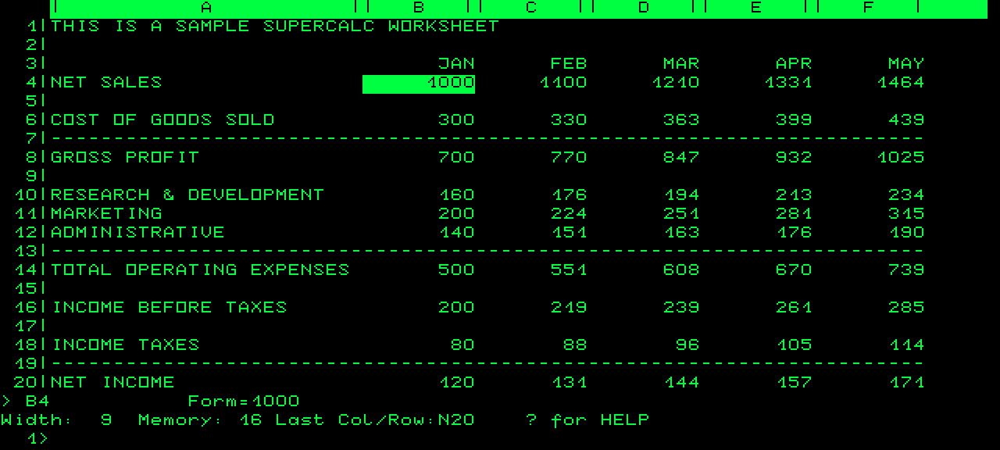

# User guide

## Hardware and image layout

P2000M SD CP/M requires a P2000M with its CP/M co-board, a 16 KiB boot
cartridge in port 1, and the SD/SRAM cartridge in port 2. The system uses no
floppy drive, floppy media, or MultiWare RAM-disk hardware.

The 153 MiB card image contains a host-accessible 64 MiB FAT32 partition and
eleven 8 MiB CP/M volumes. CP/M cannot access files in the FAT32 partition.

| Drive | Label | Contents |
| --- | --- | --- |
| A: | SYSTEM | System utilities and test programs |
| B: | TOOLS | BDS C, libraries, examples, and serial diagnostics |
| C: | ZORK | Zork I, II, and III |
| D: | CALC | SuperCalc2, installer, help and sample worksheets |
| E: | BASIC | Microsoft BASIC-80 and an example |
| F: | COBOL | Microsoft COBOL-80 and an example |
| G: | SOURCE | Empty |
| H: | DOCS | Empty |
| I: | DATA | Empty |
| J: | EXTRA 1 | Empty |
| K: | EXTRA 2 | Empty |
| L: | SCRATCH | 128 KiB SRAM disk; 126 KiB usable |

The labels are suggestions, not restrictions. A:–K: are persistent SD drives.
L: survives a warm boot but is reformatted by a reset or power cycle.

## Installing a release

Download `cartridge.bin`, `p2000m-sd-template.img.gz`, and `SHA256SUMS` from the
[latest release](https://github.com/ifilot/p2000m-cpm/releases/latest). Verify
the downloads, then decompress the image.

Program `cartridge.bin` into the port-1 ROM and write the complete raw `.img`
to an SDHC card of at least 4 GB. Copying the `.img` as a regular file to an
existing filesystem does not work. Writing the template replaces the card's
partition table and contents, so back up existing data first.

The ROM and SD kernel carry a shared release identity and must be installed as
a pair. Keep an old ROM and image together if you may need to roll back.

For the emulator, install the CP/M co-board, load `cartridge.bin` in slot 1,
install the SD cartridge in slot 2, attach a writable copy of the decompressed
image, leave the floppy drives empty, and reset.

The current software has extensive emulator coverage. The earlier 16 KiB build
was reported to boot on physical hardware; version 0.4.0 still awaits a full
hardware trial.

## Updating an existing card

The eleven SD volumes retain their layout from versions 0.1.0 through 0.4.0.
To preserve files, first read the card into an image and create an upgraded
copy:

```sh
python3 tools/update_kernel.py existing-card.img upgraded-card.img
```

The command validates the layout, refuses to overwrite its destination, and
changes only the kernel/header in the copy. It never accesses a physical card.
Install the matching cartridge ROM too. A kernel-only update does not add newly
bundled programs such as MBASIC or BDS C.

## Commands and keyboard

Useful built-in commands are `DIR [pattern]`, `TYPE file`, `ERA pattern`,
`REN new=old`, `USER 0` through `USER 15`, `SAVE pages file`, and `A:` through
`L:`. Names follow CP/M's 8.3 convention and are case-insensitive.

```text
A>DIR
A>HELLO
A>DUMP HELLO.COM
A>STAT A:DSK:
A>COPY A:HELLO.COM B:HELLO.COM
A>REN B:GREETING.COM=B:HELLO.COM
A>ERA B:GREETING.COM
```

Return submits a command and Backspace edits it. Letters are lowercase by
default; either Shift key produces uppercase. Escape followed by a letter sends
its control code, so Escape then C sends Ctrl-C and Escape then Z sends Ctrl-Z.
Escape twice sends a literal Escape. See the [keyboard reference](keyboard-reference.md)
for timing and compatibility details.

## Saving data safely

SD writes may remain buffered until a file is closed, the cache is evicted, the
drive changes, the disk is reset, or control returns to the command prompt.
Always wait for the prompt before resetting or turning off the machine. `SYNC`
forces pending writes to storage and selects A:; from another drive run
`A:SYNC`.

If a warm boot cannot flush data, follow the on-screen instruction and press R
to retry after restoring the original card. Live card swapping is unsupported.
The filesystem is not journaled, so a reset or power loss during an open file
can lose pending changes.

`CPMTEST` performs a 75 KiB create/write/read/random-read/delete test on A:.
`RAMTEST` performs the corresponding test on L:. Both may leave their test file
after an abort or failure. Press Escape then C to cancel between records.

`BANKTEST` on A: checks all seven extra 16 KiB banks on the modern-revised
co-board. It overwrites those banks, saves/restores the ordinary RAM window,
and leaves L: untouched. See the [hardware diagnostic guide](../programs/banktest/README.md)
for output, requirements and limits.

`KEYTEST` on A: displays the raw keyboard matrix and inverts each held key,
including both Shift keys and Shift Lock. The row hex values help identify
wiring errors. Exit with both Shift keys + Escape, then release them. See the
[keyboard diagnostic guide](../programs/keytest/README.md) for the display,
manual references and tests. For the corrected main-row `0/=` and `-/_`
mapping, install the new **port-1 cartridge ROM and matching SD kernel** as
well as KEYTEST; copying the COM alone cannot update the keyboard driver.

## Included software

The standard PIP, ASM, LOAD, DDT, DUMP, ED, and STAT binaries are installed on
A:. Their provenance and checksums are documented in the
[utility notes](../assets/cpm_core/README.md).

`HELP` is the compact offline reference on A:. `MORE file.ext` reads a text
file in 20-line pages; press any key to continue or Ctrl-C to stop. `RUNCOB`
is the Microsoft COBOL runtime executor and is kept on A: for its historical
launcher.

Start a Zork game from C: so it can find its data files:

```text
A>C:
C>ZORK1
```

Use `ZORK2` or `ZORK3` for the other games.

Start Microsoft BASIC on drive E:

```text
A>E:
E>MBASIC BASDEMO
```

Run `MBASIC` without a filename for interactive BASIC. `SYSTEM` returns to
CP/M. See the [MBASIC provenance notes](../assets/mbasic/README.md).

Microsoft COBOL-80 lives on F: with its overlays, linker, runtime libraries,
and the bundled `SQUARO.COB` sample. Compile it from F: with `COBOL =SQUARO`,
then link with `L80 SQUARO/N,SQUARO/E`. The linked program returns to A: and
must be launched there as `F:SQUARO`, so it can open `A:RUNCOB.COM`.

Compile and run the supplied BDS C example from drive B:

```text
A>B:
B>CC CDEMO
B>CLINK CDEMO
B>CDEMO
```

BDS C uses its historical C dialect rather than ANSI C. See the
[BDS C provenance notes](../assets/bdsc/README.md).

The built-in `SERPINS`, `SERTX`, and `SERRX` programs diagnose the P2000M's
RS232 connector. Wiring and usage are covered in the
[serial testing guide](serial-testing.md).

## Building a customized image

Developers can populate CP/M user area 0 on selected volumes with the host-side
image builder:

```sh
python3 tools/sd_image.py build/my-card.img --kernel build/kernel.bin \
    --a build/HELLO.COM build/COPY.COM MYPROG.COM \
    --drive G SOURCE.ASM --drive H MANUAL.TXT
```

The builder refuses to overwrite an existing output. Omitting `--kernel`
creates a data-only, non-bootable image. See the [source guide](source-guide.md)
for the complete build and test workflow.

## Cartridge activity LEDs

READ lights during SD reads/status commands and L: SRAM reads. WRITE lights
while writing SD sectors or L: SRAM, including the cold-boot format. The LEDs
turn off when the physical operation finishes or fails. Cached operations may
not flash them; buffered writes flash WRITE when they are actually flushed.

## Full-screen applications

The 80x24 console now accepts VT52-style cursor positioning, movement and
erasure through BDOS 2/6/9 and BIOS CONOUT. See [terminal controls and SuperCalc
configuration](terminal.md). `BANKTEST` uses the same interface for its live
per-bank dashboard. Install the rebuilt ROM and SD kernel together, then use
the new `BANKTEST.COM` from A: in the generated image.

## SuperCalc2

SuperCalc2 1.00 is ready to use on D: with the P2000M terminal profile:

```text
A>D:
D>SC2
```

Press Return to open the spreadsheet, or `?` for help. Use the arrow keys to
move between cells. Enter a number or formula and press Return; for example,
enter `6`, `7`, and `A1*B1` in successive cells to get `42` in C1. `=A1` followed
by Return moves directly to A1. The active cell is shown in inverse video.

- Load a sample: `/L`, then `SAMPLE` and Return, then `A` for all.
- Save your work: `/S`, then a filename and Return, then `A` for all.
- Exit: `/Q`, then `Y`. This edition returns to the A: prompt.

Wait for each prompt, especially during overlay loading. Keep `SC2.OVL` and
`SC2.HLP` on D: with `SC2.COM`. The bundled copy needs no installer run.
`INSTALL` is included for later customization; choosing its stock VT52 profile
would reset the P2000 arrow and highlighting settings.



See [tested terminal configuration](terminal.md#bundled-supercalc2) and
[software provenance](../assets/supercalc/README.md). The emulator regression
covers calculations, navigation, help and save/reload across a fresh boot;
actual hardware testing remains to be done.
