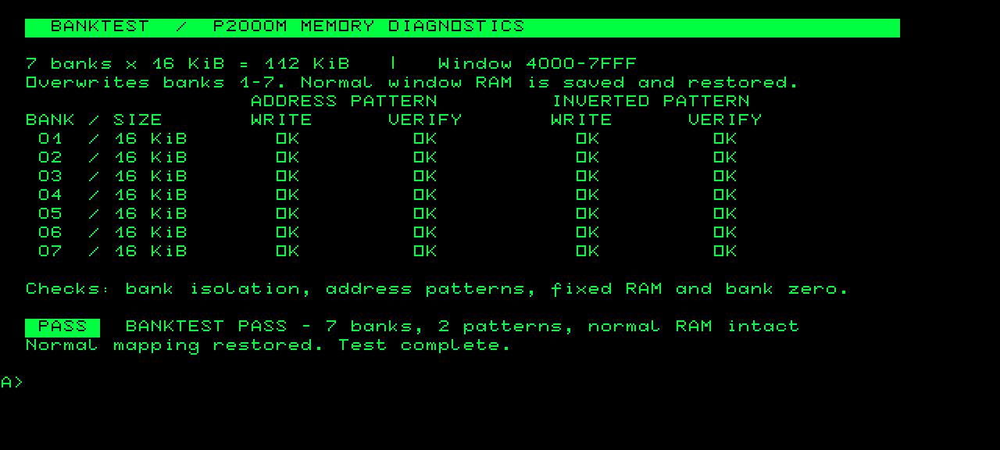

# BANKTEST

Run `BANKTEST` from A: under this CP/M system with the modern-revised co-board
and working bank-capable CPLD firmware. Banking has now been confirmed on actual
hardware. The build installs `BANKTEST.COM` on A: in
`build/p2000m-sd-template.img` and also produces `build/BANKTEST.COM` separately.
The dashboard needs the updated [terminal controls](../../docs/terminal.md):
upgrade the cartridge ROM and SD kernel as a matched pair. No kernel banking
extension is needed; the kernel still leaves the extra banks unused.

The program **overwrites all seven extra SRAM banks (112 KiB)**. Do not run it
while a future banked RAM drive/cache or bank-aware application holds data there.
It does not access SD or cartridge SRAM L: except for CP/M loading the program.

It writes a bank-specific address pattern across all 16,384 bytes of every
bank, then revisits all seven banks to verify independence. It repeats with
complementary patterns, so every SRAM data bit is tested as both zero and one.
It checks read-only probes outside the window while each bank is active,
checks the underlying expansion RAM, and verifies that selecting bank zero
leaves ordinary RAM visible. This is a functional test, not a timing or
exhaustive electrical/memory-coupling test.

The dashboard shows a row for each bank, with separate WRITE and VERIFY cells
for the address pattern and its complement. Each cell changes from `--` to an
inverse-video `BUSY`, then `OK`. A highlighted PASS or FAIL report appears below
the table, retaining the first failing bank, address and expected/actual bytes.



On failure it stops at the first mismatch and prints, for example:

```text
BANKTEST FAIL bank 04 addr 6123 expected 46 got 47
```

All numbers in the failure report are hexadecimal. Bank 00 denotes the
underlying expansion-RAM/bank-zero-disable check. A failure on an older board
without the bank latch is expected; it does not mean its ordinary RAM is faulty.
Revision 0.6 has a known decode overlap: banked 7000–7FFF also selects
video RAM, corrupting the screen and failing at bank 01 / address 7000.
Observed bytes can vary (25h and 27h were reported against expected 71h).
The attempted revision 0.7 correction subsequently failed to boot on hardware.
These are historical failure signatures; subsequent hardware testing confirmed
working banking. The new display requires the updated ROM/kernel console.
Use the address and expected/actual byte to investigate other bank decode or data
wiring faults. Severe mapping faults that overwrite executing code or resident CP/M
can prevent a clean report or return.

The diagnostic saves the ordinary 4000–7FFF window at 8000–BFFF and restores it
on success and reported failure. That backup area is application scratch space
and is overwritten. The program and private stack (top 3F00h) are below the
window. Interrupts are masked while a bank is visible; the entry interrupt
state and stack are restored on return. Console calls happen only with the
normal map restored. Keyboard input is not serviced during the individual
bank passes; there is no interactive cancellation. Direct BDOS output prevents
Ctrl-C or flow-control input from interrupting restoration. This assumes the normal
CP/M map on entry and no external NMI source during the test.

Rebuild the standalone file with:

```sh
z80asm -o build/BANKTEST.COM programs/banktest/banktest.asm
```

`python3 tools/build.py` also installs it in the generated A: drive image.
Tests run the COM under the real CP/M loader and separately against good,
non-banked, aliased-bank and stuck-bit models, checking restoration on both
success and failure.
