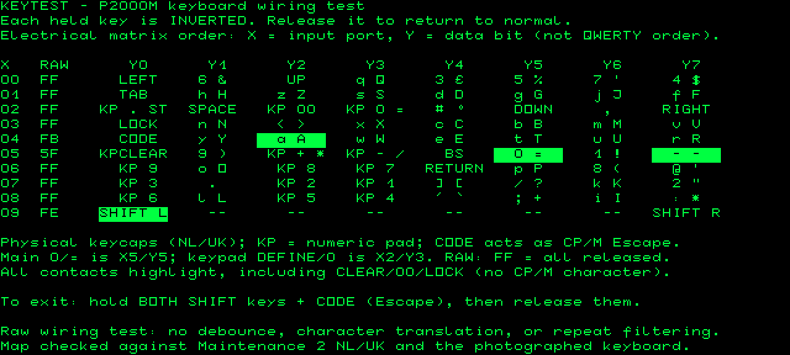

# KEYTEST

Run `A:KEYTEST` to inspect the P2000M keyboard wiring. Every held key inverts
its seven-character tile; releasing it restores normal video. Multiple keys
highlight independently, including both Shift keys and Shift Lock. Exit by
holding **both Shift keys and CODE (Escape)**, then releasing those three keys.

The display uses **electrical matrix order**, rather than physical QWERTY order:
X is the input port (00h–09h), Y is the data bit (0–7). Each row also shows its
raw active-low hexadecimal value: FF means released, FE means bit 0 pressed.
This makes a wrong row/bit, stuck contact, or unexpected connection visible.
All 80 positions are displayed, including positions ignored by the CP/M driver.
Unused positions (`--`) and untranslated CLEAR/00/LOCK contacts respond too.

Letter tiles show lowercase and uppercase. Paired legends show the physical
normal/shifted keycaps; KP identifies numeric-pad keys. Main-row **0/= is
X5/Y5**, its adjacent **minus/underscore is X5/Y7**, and **keypad DEFINE/0 is
X2/Y3**. KEYTEST does not generate translated input or implement Shift Lock.
See the [audited map](../../docs/keyboard-reference.md#physical-nluk-map-audit-2026-09-20)
for the CP/M ASCII approximations and untranslated special functions.



## Manual and mapping references

Consulted the local **P2000 Field Support Manual**, edition 8111:

- §3.1.2, printed pp. 3-5–3-7, figure 3.2: ten X scan lines, eight Y read
  lines, ports 00h–09h, active-low keys and the normal 20 ms scan cadence.
- §7.1.3, printed p. 7-4: displaying the keyboard with inverse character
  positions for the professional (M) version's keyboard test.
- §7.1.4.1, printed p. 7-4: DEFINE is Shift and numeric-pad zero.

The readable scan is in the sibling project at
`p2000m-drive-test/references/manuals/FieldSupportManual.pdf` (PDF pages 13–15
and 69). The sibling co-board project's `P2000MT Field Support Manual.pdf`
is another scan of this manual.
The manuals are reference material, not build dependencies.

The per-key positions were independently checked against the NL/UK tables and
keyboard-test display of the original **Maintenance 2, REL 2.2** cartridge,
and the keycaps against the supplied keyboard photograph. The linked audit
records the binary URL, hash, offsets and screen coordinates. The earlier
labels based only on `src/console.asm` incorrectly called main-row zero a
keypad key and keypad STOP/dot a second Return.

`screen.inc` contains native glyphs: 23h is sterling, 5Fh hash, 60h underscore,
0Ah/0Bh grave/acute, 0Fh/10h brackets and 1Bh degree. It is not ASCII output.

## Implementation and tests

`python3 tools/build.py` creates `build/KEYTEST.COM`, installs it on A: in the
SD template, and includes it in the checksums. Install the rebuilt port-1
`cartridge.bin` and matching SD kernel as well: KEYTEST does not change the
ROM-resident CP/M keyboard driver. This is specific to the P2000M
SD CP/M memory map: characters at F000h and attributes at F800h. It reads the
hardware ports directly with interrupts disabled while testing, so the resident
scanner cannot translate Escape, repeat keys, or fill the type-ahead queue.
The display follows raw signals without debounce; very short contact chatter
may be too fast to see. The program performs no output-port or disk writes.

On exit it waits for the exit chord to release, synchronizes/drains the BIOS
input state (including queued NUL), clears the screen, and warm boots to restore
the normal keyboard interrupts. Other stuck contacts do not prevent exit.
No single ordinary key is reserved, so Escape and each Shift remain testable.

Run:

```sh
python3 tools/build.py
python3 -m unittest discover -s tests -p test_keytest.py -v
```

The test boots the actual kernel, loads the COM through CCP from the built SD
image, and injects all 80 matrix inputs. It checks every character/attribute
cell for each press and release, simultaneous contacts, long holds, modifiers,
bounce, native punctuation, exit with another stuck key and queued NUL,
exit/relaunch, subsequent HELLO execution, resident
stack guards, packaged bytes/checksums and preservation of the entire SD image.
These are emulator checks; testing actual wiring still requires the P2000M.
